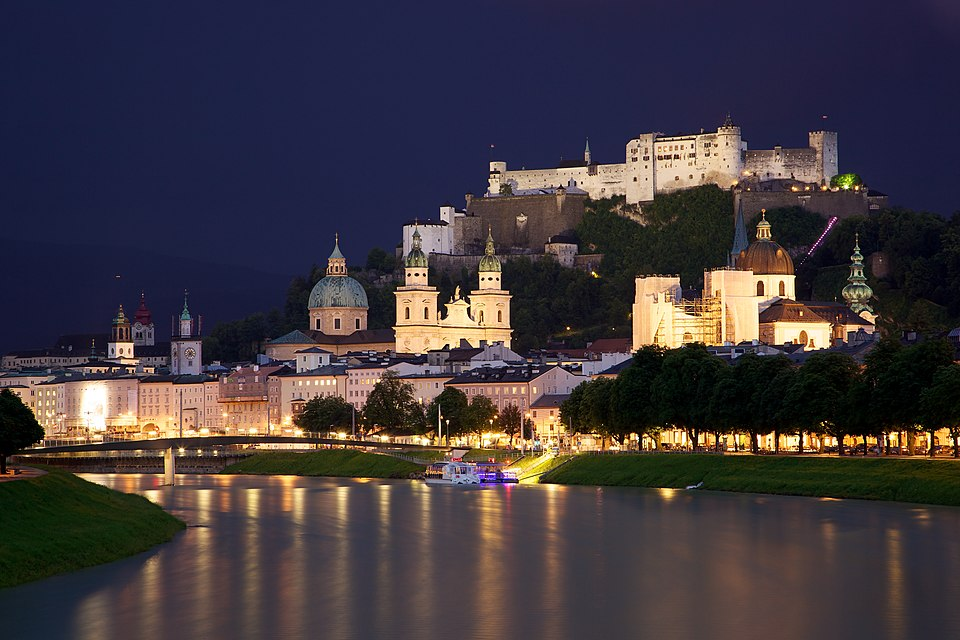
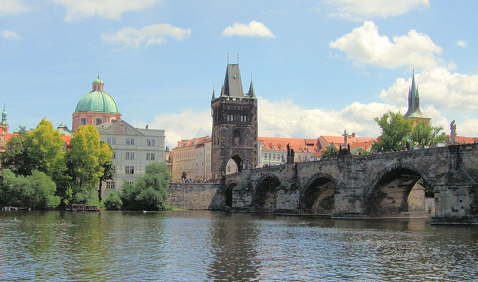
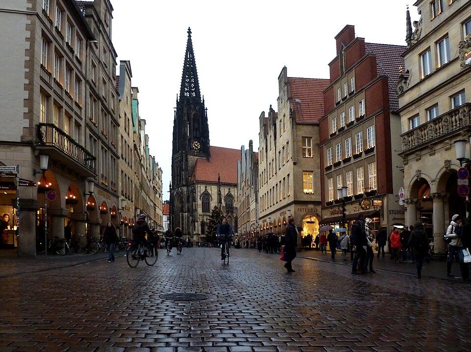

# Spatial Data Science across Languages Community

The ‘Spatial Data Science across Languages’ (SDSL) community seeks to bring
together the communities from the common and emerging programming languages used
for data science such as R, Python and Julia, to discuss interoperability,
methodological developments, and shared challenges such as interfacing upstream
libraries (including GDAL, GEOS, and PROJ), packaging and distributing software,
and managing user and developer communities.

## Annual Workshop

Our main activity since 2023 has been annual workshops which provide a space for
bridging the various programming-language communities and establishing
cross-language interaction between developers and users.

The SDSL workshops aim to identify commonalities and differences between spatial
data science languages, to bridge language barriers and to bring the different
communities together to discuss, cooperate, and synchronise the development
efforts.

### SDSL 2026 - to be announced

Currently planning for September 2026.

### SDSL 2025 - Salzburg, Austria

<figure>
  
  <figcaption>
    <a href="https://commons.wikimedia.org/wiki/File:Old_Town_Salzburg_across_the_Salzach_river.jpg">&copy; Jiuguang Wang 2011 CC-BY-SA 3.0</a>
  </figcaption>
</figure>

### SDSL 2024 - Prague, Czechia

<figure>
  
  <figcaption>
    <a href="https://commons.wikimedia.org/wiki/File:The_Charles_Bridge,_Prague..jpg">&copy; Jim Linwood 2008 CC-BY 2.0</a>
  </figcaption>
</figure>

### SDSL 2023 - Münster, Germany

<figure>
  
  <figcaption>
  <a href="https://commons.wikimedia.org/wiki/File:M%C3%BCnster_-_Prinzipalmarkt_-_Lambertikirche.jpg">&copy; Oxfordian Kissuth 2011 CC-BY-SA 3.0</a>
  </figcaption>
</figure>

## Discord

SDSL has a Discord server for discussions and communication during the
workshops. Please join via <https://discord.gg/HJRKEJsmrr>.
