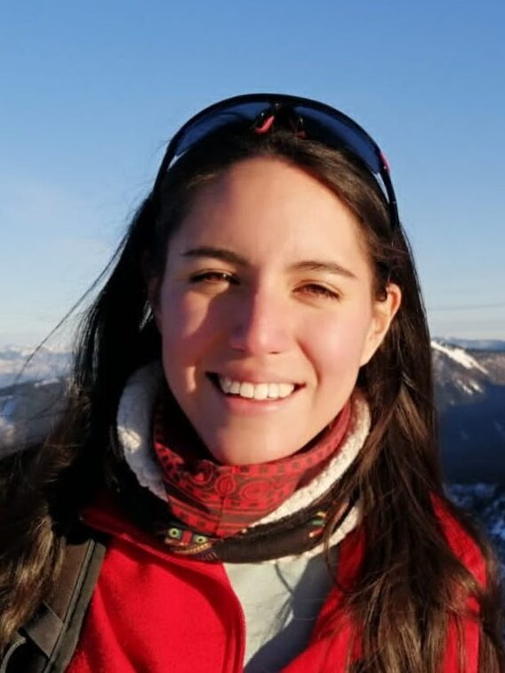

The Lorena Abad Crespo Award for Innovation in Spatial Data Science is awarded annually by the SDSL Community to individuals who have brought significant innovation to open spatial data science. It honours those who have pushed the boundaries of open source software for SDS and offered their ideas transformed into tools to the wider community.

::: {.callout-tip}
# Nominations are open

The nominations for 2026 Award are open. Please submit your nominations using the [nomination form](https://docs.google.com/forms/d/e/1FAIpQLSeG_rb8Zldf-HQ_WCDhWYM2qp4NAmoGZHWXPItXQ_k2LcycVA/viewform?usp=dialog) by the end of May 2026.
:::

## Lorena Cristina Abad Crespo

::: {style="float: left; margin-right: 25px;"}
{width=250px}
:::

Lorena Abad Crespo was one of the core members of the SDSL Community since its inception, co-author of the first [report](https://spatial-data-science.github.io/reports.html#spatial-data-science-languages-commonalities-and-needs), and a main organiser of SDSL Workshop 2025 in Salzburg. Before we were able to meet in Salzburg, Lorena's life was cut short in a traffic collision. This award honours Lorena's life, spirit, and contributions to SDS.

Lorena was born in Ecuador and studied environmental engineering at the University of Cuenca. Afterward, she obtained an Erasmus Mundus scholarship and received a Master's degree in Geospatial Technologies from the programme offered by universities in Lisbon, Castellón, and Münster. That is when she got involved in open source development, with R being her language of choice. After graduating, she moved to the University of Salzburg, where she later started her PhD. She was consistently pushing the boundaries of spatial data science and GIS by breaking away from constraints of common data structures and inventing new ways of managing and analysing data. Her work on vector data cubes has changed the meaning of the concept and transcended from R to Python and Julia. An avid supporter of open science, she encouraged everyone to do the right thing and to share their knowledge and ideas with the world. In doing so, she became a role model for others.

She was not only a sharp developer and a thoughtful scientist but primarily a wonderful human being. It was Lorena who opened her heart to all, spread optimism and passion, and strived to create a better world for everyone. She was there for those who loved her, for friends, and for the entire community.

Those who follow in her footsteps are those to be awarded.

## Scope

The SDSL Community aims to remember Lorena's legacy by awarding those who share her spirit for openness and innovation, as well as exceptional attention for detail. We value new perspectives, new ideas, and models that can be of value to the wider spatial data science community.

The Award is given to individuals or groups who have developed innovative solutions for open spatial data science and turned them into reusable tools released under a permissive OSI-approved license. Typically, these are software packages written in R, Python, Julia, or other languages. They not only contain innovative code but also provide high-quality documentation to teach others, while fostering a welcoming environment for new contributors. However, the scope is not restricted to software, and other contributions (e.g. community management, or training) may also be considered. We especially welcome submissions from those belonging to traditionally underrepresented groups and from young researchers.

The submissions that are within the scope for the Award shall be published no earlier than three years prior to the Call for Nominations being open. That means that for the Award given in 2026, with the Call opening in May 2026, the contributions within the scope were published between May 2023 and May 2026.

## Selection process

The Call for Nominations will be opened yearly for a month to gather nominations for the Award from the SDSL community and beyond.

The nominations will be evaluated by the SDSL Steering Committee, and the winner will be chosen by the Committee's consensus.

::: {.callout-tip}
# Nominations are open

The nominations for 2026 Award are open. Please submit your nominations using the [nomination form](https://docs.google.com/forms/d/e/1FAIpQLSeG_rb8Zldf-HQ_WCDhWYM2qp4NAmoGZHWXPItXQ_k2LcycVA/viewform?usp=dialog) by the end of May 2026.
:::

## Winner

The winner will be announced at the annual SDSL Workshop, receive a certificate and a mention on the SDSL website. A travel stipend, when available, will be awarded to the winner(s) of the award to attend the Workshop.